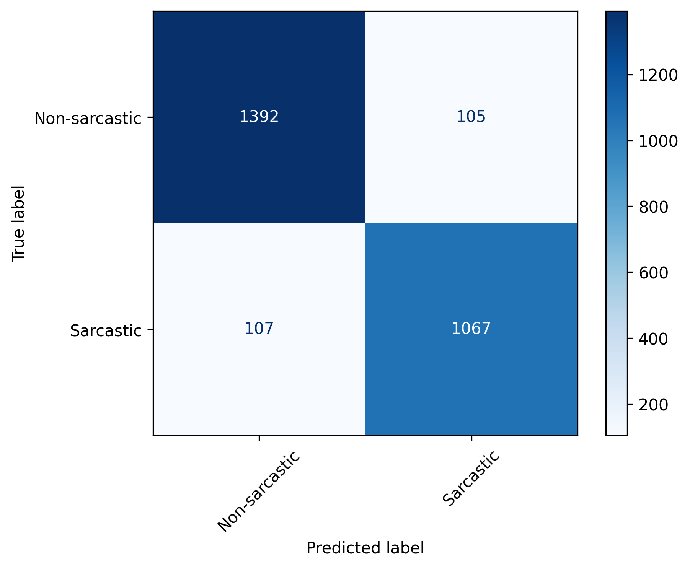
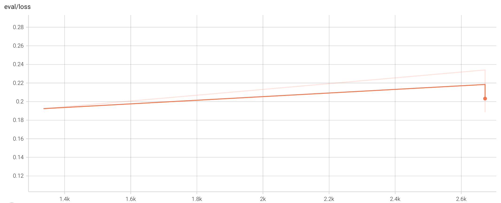

# Sarcasm Detection with DistilBERT

This project fine-tunes Hugging Face’s DistilBERT model to detect sarcasm in news headlines. Additionally, it benchmarks performance against a zero-shot baseline using flan‑T5‑small.

---

## 📂 Project Structure

```
sarcasm_project/
├── prepare_data.py
├── train_distilbert.py
├── evaluate.py
├── zero_shot.py
├── requirements.txt
├── submission_link.txt
├── README.md
├── results/
│   ├── zero_shot.json
│   └── finetune.json
├── fig/
│   ├── cm.png
│   └── tensorboard_eval_loss.png
└── ckpt/
    ├── config.json
    ├── tokenizer.json
    ├── tokenizer_config.json
    ├── special_tokens_map.json
    └── vocab.txt
```

---

## ⚙️ Environment Setup

It is recommended to use a virtual environment:

```bash
python3 -m venv venv
source venv/bin/activate   # On macOS/Linux
# venv\Scripts\activate    # On Windows

pip install -r requirements.txt
```

---

## 🚀 How to Run

1. **Prepare Data**
   ```bash
   python prepare_data.py --input data/Sarcasm_Headlines_Dataset.json --output_dir data
   ```

2. **Run Zero‑Shot Baseline**
   ```bash
   python zero_shot.py --data_dir data/raw --out_file results/zero_shot.json
   ```

3. **Fine‑Tune DistilBERT**
   ```bash
   python train_distilbert.py --data_dir data/tokenized --output_dir ckpt --epochs 2 --lr 2e-5
   ```

4. **Evaluate Model**
   ```bash
   python evaluate.py --data_dir data/tokenized --ckpt ckpt/best_model --out_file results/finetune.json
   ```

5. **TensorBoard Visualization**
   ```bash
   tensorboard --logdir tb_logs
   ```

---

## 📊 Results

| Model                   | Accuracy | Macro‑F1 |
|-------------------------|---------:|---------:|
| Zero‑shot flan‑T5‑small |   0.56   |   0.36   |
| DistilBERT (Fine‑Tuned) |   0.92   |   0.92   |

---

### 🎯 Confusion Matrix


### 📈 Validation Loss Curve


---

## 📖 References

- **Dataset**: Sarcasm Headlines Dataset (Aker, Ksoll & Lybbert, 2012)
- **Transformers Library**: https://huggingface.co/docs/transformers
- **IEEE Template**: https://www.overleaf.com/latex/templates/ieee-conference-template/grfzhhncsfqn

---

## 📥 Submission

- Final Report: `ZixuanWu_FinalProject.pdf`
- GitHub Link: Included in `submission_link.txt`
